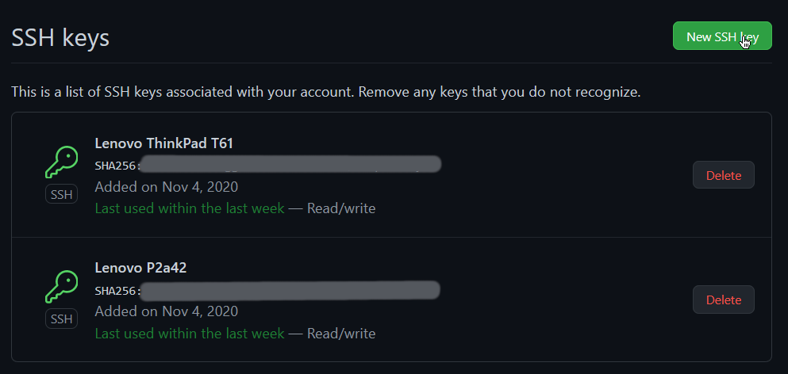
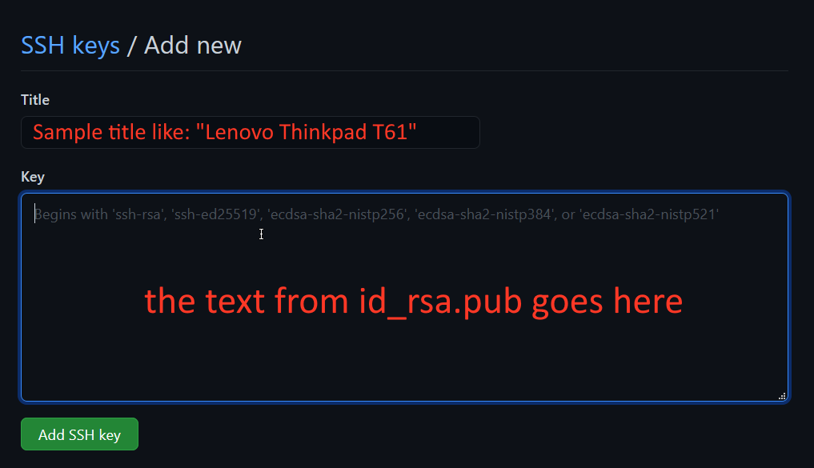

# Setting up ssh

## Downloading openssh
```bash
sudo pacman -S openssh
```
## Generating ssh keys

- Generate keys with this command (`-t rsa` can be omitted, because RSA is the default option)
```bash
ssh-keygen -t rsa -b 4096
```
- Your new keys will now be in `~/.ssh/id_rsa` and `~/.ssh/id_rsa.pub` respectively
- Now you can copy your key to another machine by running
```bash
ssh-copy-id reo101@192.168.0.101 # or just the ip address if the username matches yours
```
## Adding your new ssh key to github.com

- Firstly open the settings menu


- Then open the SSH and GPG Keys menu


- Click on New Key


- Enter a key name (identifier) and the key itself


- Now enter you github password


- We're done! You can now use `ssh` to communicate with github
